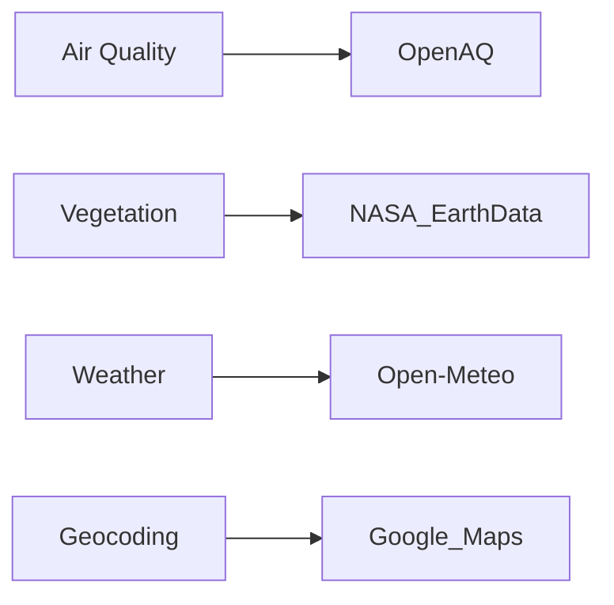
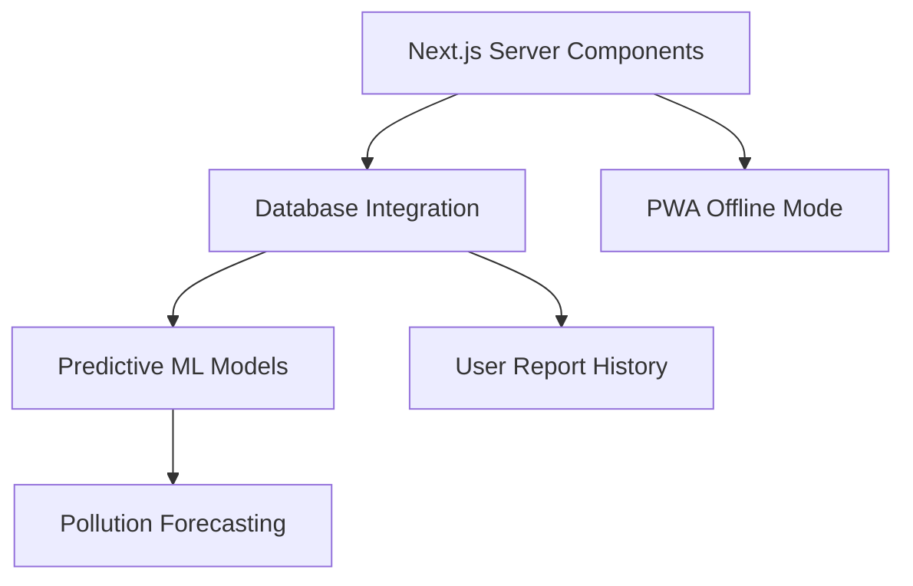

# 🌍 EcoCarto: Environmental Health Mapping Platform  

**Making ecological awareness accessible and actionable for everyone**  

 
  

## 🚀 Overview  
EcoCarto is an interactive web-based Environmental Health Map that visualizes the ecological status of any location using real-time air quality (AQI) and vegetation index (NDVI) data. Born from the need to address rising pollution and climate challenges, this tool empowers individuals, planners, and communities to make informed environmental decisions.  

**Core Solution**: Combines real-time ecological data with historical context through intuitive visualizations and actionable insights.  

---

## ✨ Key Features  
- **🌱 Eco Score System** - A-F grade combining AQI, vegetation, humidity & temperature  
- **🟢🔴 Risk Visualization** - Color-coded zones (Green/Moderate/High Risk)  
- **📅 Historical Trends** - Environmental data from 2015 to present  
- **🌿 Smart Plantation** - Data-driven recommendations for degraded areas  
- **📊 Downloadable Reports** - PDF exports for ecological planning  
- **🔥 Interactive Heatmaps** - AQI/NDVI visualization layers  
- **📍 Live Location Search** - With geolocation suggestions  

---

## 🛠️ Tech Stack  
 
 
 
  

### Visualization  
 
 
  

### Data APIs  

### Roadmap

